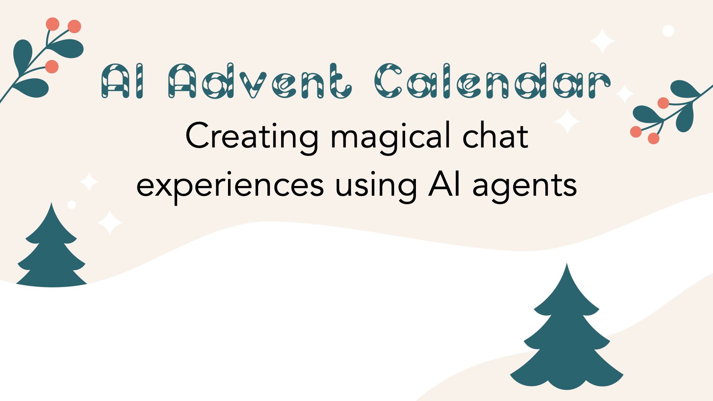

# 🎄 AI Advent Calendar 2024: 24 Days of AI Agent Challenges in Online Retail

Welcome to the **AI Agent Advent Calendar 2024**, a daily exploration of how **AI agents** can transform online retail by addressing the limitations of naive chatbots.



## 📖 About This Series

Every day in December, I'll publish a new Jupyter Notebook highlighting a common challenge faced by Retrieval-Augmented Generation (RAG) chatbots and demonstrating how **AI agents** overcome these obstacles.  

Through code, visualizations, and step-by-step explanations, you'll learn how to build smarter AI systems for your e-commerce applications.

### What You'll Find Here

- **Daily Challenges**: Each notebook addresses a specific chatbot limitation, such as:
  - Asking clarifying questions
  - Maintaining multi-turn conversation context
  - Personalizing recommendations
- **Hands-On Notebooks**: Ready-to-run Jupyter Notebooks with detailed walkthroughs
- **Real-World Use Cases**: Practical examples tailored to online retail, complete with code snippets, diagrams, and agent workflows

### 🌟 Featured Day 1 Challenge

**How AI Agents Improve Naive Chatbots by Asking Clarifying Questions**  

- Discover how AI agents enhance user interactions by interpreting ambiguous queries and dynamically refining results.

## 🚀 How to Use This Repo

1. **Clone the Repo**

    ```bash
    git clone https://github.com/norahsakal/ai-agent-advent-calendar-2024.git
    cd ai-agent-advent-calendar-2024
    ```

2. **Install Dependencies**
Make sure you have Python and Jupyter Notebook installed. Use pip to install the required libraries:

    ```bash
    pip install -r requirements.txt
    ```

3. **Run the Notebooks**
Open Jupyter Notebook:

    ```bash
    jupyter notebook
    ```

4. **Explore Daily Challenges**
Each notebook is self-contained and walks you through the concepts with code and explanations.

### 🛍 Meet SoleMates

**SoleMates** is our fictional online shoe store and the foundation for this series.  

I've designed SoleMates to illustrate real-world e-commerce challenges, focusing on interactions between customers and chatbots. Using SoleMates' fictional shoe catalog, we'll explore the differences between naive chatbot systems and advanced AI agents.


### Included Data and Assets

- **CSV Files**: Contains product data for SoleMates, including product titles, categories, and metadata
- **Footwear Images**: A set of images representing SoleMates' products, used in visualization tasks

These assets are included in the repo to ensure you can follow along with each challenge seamlessly.

### ✨ Why This Matters

Naive chatbots often fail to meet customer expectations in dynamic e-commerce environments.

By adopting AI agents, you can:

- Enhance customer experience with smarter, context-aware interactions
- Increase conversion rates with tailored recommendations
- Build scalable systems that adapt to complex queries effortlessly

### 📩 Reach Out

If you'd like to improve the notebooks or share ideas for challenges, feel free to reach out.

Have questions about implementing these solutions in your business? Contact me at <info@braine.ai>

## Previous issues walkthrough

🎄 Dec 1: [How AI Agents Ask Clarifying Questions](https://norahsakal.com/blog/ai-advent-calendar-2024-ai-agents-ask-clarifying-questions)
🎄 Dec 2: [How AI Agents Understand Context Shifts](https://norahsakal.com/blog/ai-advent-calendar-2024-ai-agents-understand-context-shifts)
🎄 Dec 3: [How AI Agents Handle Requests for Specific Measurements](https://norahsakal.com/blog/ai-advent-calendar-2024-ai-agents-handle-numerical-requests)
🎄 Dec 4: [How AI Agents Handle Multiple Product Requests in One Query](https://norahsakal.com/blog/ai-advent-calendar-2024-ai-agents-multiple-requests)
🎄 Dec 5: [How AI Agents Handle Price-Based Queries](https://norahsakal.com/blog/ai-advent-calendar-2024-ai-agents-price-filter)
🎄 Dec 6: [How AI Agents Offer Style Suggestions](https://norahsakal.com/blog/ai-advent-calendar-2024-ai-agents-style-suggestions)
🎄 Dec 7: [How AI Agents Handle Unavailable Colors Gracefully](https://norahsakal.com/blog/ai-advent-calendar-2024-ai-agents-unavailable-colors)
🎄 Dec 8: [How AI Agents Handle Negations in Queries](https://norahsakal.com/blog/ai-advent-calendar-2024-ai-agents-negations)
